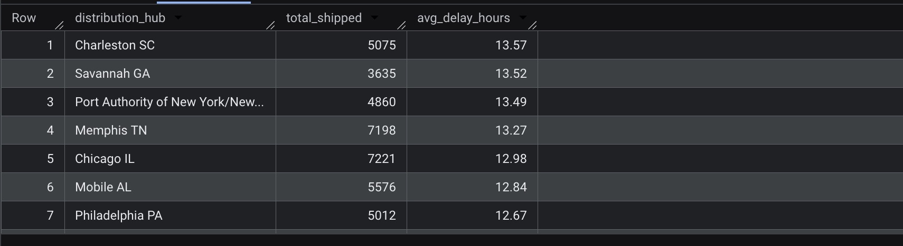
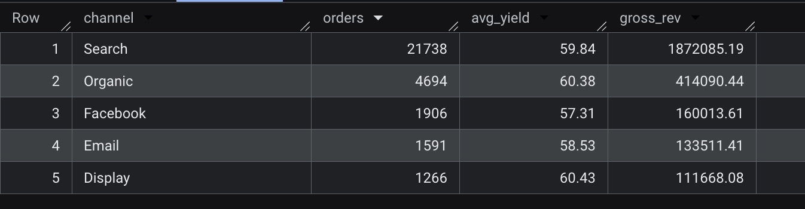

Overview

In high-growth, high-velocity environments (eCommerce/Airlines/Supply chain networks), waiting for centralized BI dashboards often creates a decision-making bottleneck. This repository contains lean SQL procedures that help you bypass reporting bloat and get immediate, "truth-seeking" visibility into operational throughput and commercial yield.

Technical Infrastructure

Environment: Google BigQuery
Dataset: bigquery-public-data.thelook_ecommerce
Methodology: Agile Data Ops (Focusing on speed-to-insight and minimal code overhead)

Key Audits

1. Operational Throughput (SLA Compliance)
Objective: Identify distribution hubs failing the 24-hour "Ready-for-Shipment" target.
Logic: Calculates real-time processing speed by measuring the time gap between when an order is placed and when it is actually shipped.
Business Impact: Pinpoints exactly where the supply chain is slowing down, providing the data needed to renegotiate vendor contracts or adjust staffing levels.

2. Lean Channel Performance
Objective: Identify which sales sources (like Google Search, Direct Web, or App Integrations) are actually making money.
Logic: We only count "Completed" orders. This ignores any "cancelled" or "returned" orders that would otherwise clutter our numbers and make us think we are more profitable than we actually are.
Business Impact: Clearly shows which marketing channels bring in the most reliable revenue, helping us decide where to spend our budget.

3. Bottom line performance (Profitability)
Objective: Identify which product categories are the real "profit engines" versus those that are just busywork.
Logic: Calculates the Actual Profit per item by subtracting the wholesale cost from the final sale price. It focuses on the money we actually keep after the supplier is paid.
Business Impact: Prevents "unprofitable growth." It allows the business to pivot toward high-margin inventory and stop wasting marketing budget on items that don't move the needle for the bank account.

How to Use

1. Access the bigquery-public-data.thelook_ecommerce dataset in the Google Cloud Console.
2. Run the queries found in lean_channel_performance.sql.
3. Adjust the WHERE clauses for specific date ranges or status filters as required for agile pivoting.

